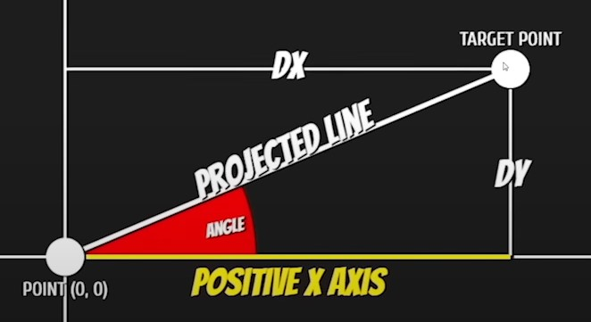
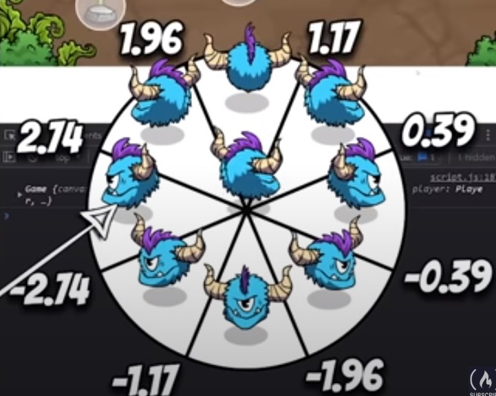
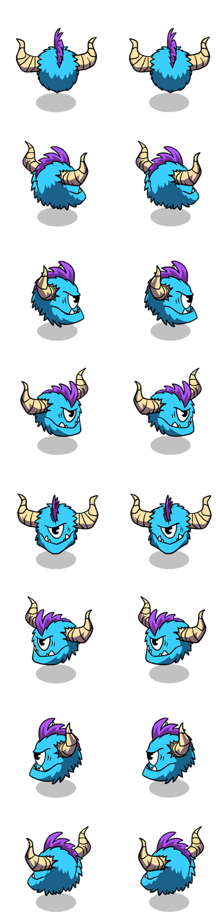

# Learn Game Dev with Vanilla Javascript


# Description

Timestamp: 2:14

# Table of contents

0.
1. Draw a circle of collision
2. Moving object at constant speed
3. Animation angles
4.

# Techniques

## 1. Draw a circle of collision

```javascript
context.beginPath(); // tell js to begin to draw
context.arc(
	this.collisionX,
	this.collisionY,
	this.collisionRadius,
	0,
	Math.PI * 2
);

// to limit certain canvas settings only to specific draw calls, we can wrap that drawing code between save() and restore() built-in canvas methods.
context.save(); // save all current settings
context.globalAlpha = 0.5;
context.fill();
context.restore(); // restore all settings

context.stroke();
```

## 2. Moving object at constant speed


O moves from A to B, B is destination

```javascript
dx = B.x - O.x;
dy = B.y - O.y;
distance = Math.hypot(dy, dx);
O.x += dx / distance;
O.y += dy / distance;
```

Sometimes, we want object to move close enough to B but not to B. To avoid shaking when this object try to correct itself:

```javascript
dx = B.x - O.x;
dy = B.y - O.y;
distance = Math.hypot(dy, dx);
if (distance > speedModifier) {
	speedX = dx / distance || 0;
	speedY = dy / distance || 0;
} else {
	speed = 0;
	speed = 0;
}
```

## 3. Animation angles



To calculate the angle from the character to target, use `arctan` with `dy, dx`. Result in radiant





```javascript
if (angle < -2.74 || angle > 2.74) this.frameY = 6;
else if (angle < -1.96) this.frameY = 7;
else if (angle < -1.17) this.frameY = 0;
else if (angle < -0.39) this.frameY = 1;
else if (angle < 0.39) this.frameY = 2;
else if (angle < 1.17) this.frameY = 3;
else if (angle < 1.96) this.frameY = 4;
else if (angle < 2.74) this.frameY = 5;
```

# Usage

# Screenshots


# Contributors

# References

[Youtube - Javascript GameDev Tutorial]("https://www.youtube.com/watch?v=U34l-Xz5ynU" "freeCodeCamp")
