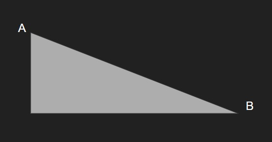

# Learn Game Dev with Vanila Javascript


# Description

# Techniques

## Moving object at constant speed



O moves from A to B, B is destination

```javascript
dx = B.x - O.x;
dy = B.y - O.y;
distance = Math.hypot(dy, dx);
O.x += dx / distance;
O.y += dy / distance;
```

Sometimes, we want object to move close enough to B but not to B. To avoid shaking when this object try to correct itself:

```javascript
dx = B.x - O.x;
dy = B.y - O.y;
distance = Math.hypot(dy, dx);
if (distance > speedModifier) {
	speedX = dx / distance || 0;
	speedY = dy / distance || 0;
} else {
	speed = 0;
	speed = 0;
}
```

# Table of contents

0.
1.
2.
3.

# Usage

# Screenshots


# Contributors

# References

[Go to github]("https://github.com/the0nlyWyvern" "github.com")
